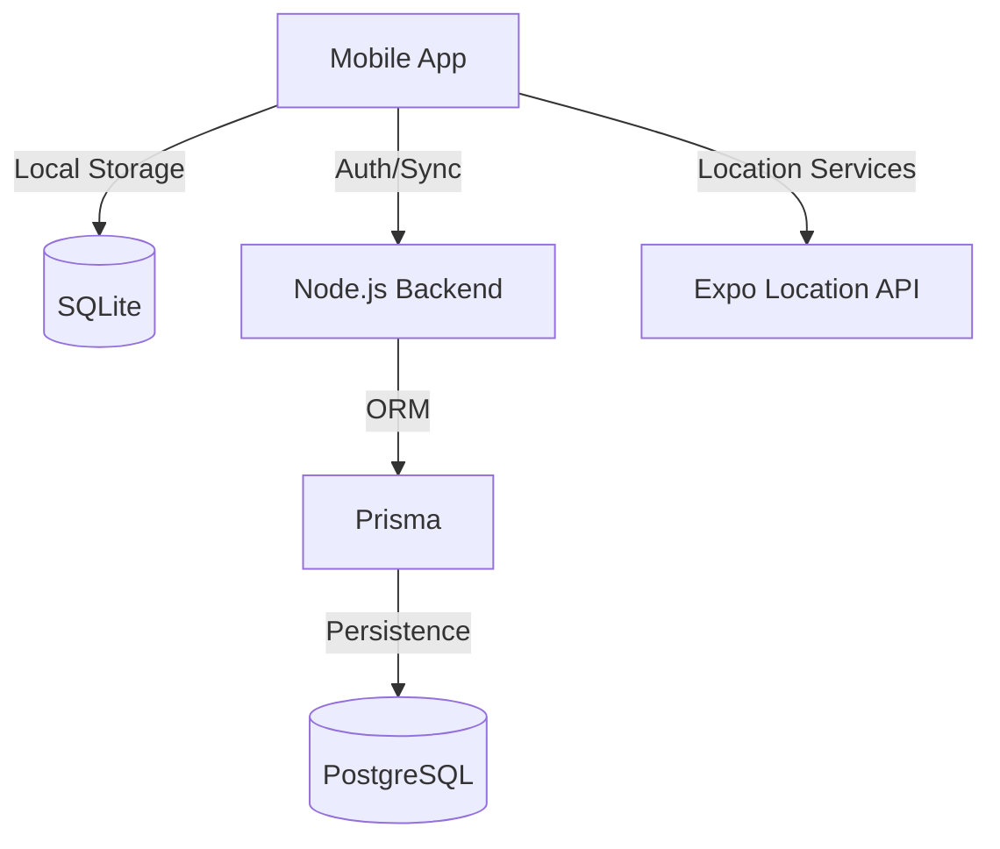

# Smart Travel — Full Technical Documentation 📘

This document provides a comprehensive deep-dive into the architecture, design, and implementation of the **Smart Travel Expense App**.

---

## 1. Project Overview
Smart Travel is a mobile-first solution designed to track travel logistics and expenses in real-time. It solves the problem of tracking journeys in remote areas with poor connectivity by utilizing a local-first SQLite architecture that periodically synchronizes with a central PostgreSQL cloud database.

## 2. System Architecture
The system follows a classic **Client-Server** architecture with an emphasis on **Offline-First** capabilities.

- **Mobile Client**: React Native (Expo) app handling UI, location tracking, and local data persistence via SQLite.
- **Backend API**: Express.js server providing RESTful endpoints for Authentication and Data Synchronization.
- **Data Layer**: 
    - *Local*: SQLite stores every trip, expense, and GPS point as they happen.
    - *Cloud*: PostgreSQL stores the "source of truth" once the device is online and triggers a sync.

## 3. Tech Stack Reasoning
- **React Native & Expo**: Allows for cross-platform development with native performance and high-speed iteration via Expo Go.
- **SQLite**: The industry standard for local mobile storage, providing ACID compliance and high-performance querying on-device.
- **Node.js & TypeScript**: Unified language (JS/TS) across the stack provides better developer experience and type safety.
- **Prisma**: Type-safe ORM that simplifies complex SQL queries into readable TypeScript code.
- **Zustand**: A lightweight state management library used for theme switching and simple app states.

## 4. Folder Structure

### Backend (`/backend`)
- `prisma/`: Contains `schema.prisma` (the DB blueprint).
- `src/lib/`: Database client configuration.
- `src/middleware/`: Authentication and error handling logic.
- `src/routes/`: REST endpoint definitions (Sync, Auth, Analytics).
- `src/index.ts`: The main Express application entry point.

### Mobile (`/mobile`)
- `src/context/`: Authentication state provider.
- `src/database/`: SQLite initialization and schema migrations.
- `src/hooks/`: Custom hooks for data fetching (e.g., `useTrips`).
- `src/screens/`: Individual UI views.
- `src/services/`: Logic for Background Location and Cloud Sync.
- `src/store/`: Theme and preferences storage.

## 5. Database Schema

### Trip Model
| Field | Type | Description |
|---|---|---|
| `id` | UUID | Primary Key |
| `start_time` | DateTime | ISO Timestamp |
| `start_point` | String | Optional destination name |
| `total_expense`| Float | Aggregated cost in ₹ |
| `is_synced` | Int (0/1) | Sync status flag |

### Expense Model
| Field | Type | Description |
|---|---|---|
| `amount` | Float | Value in ₹ |
| `category` | String | Meal, Transport, etc. |
| `payment_method`| String | Cash, Card, UPI |

## 6. Code Flow & Logic

### Cloud Sync Engine
1. The app queries SQLite for any rows where `is_synced = 0`.
2. It bundles these into batches (chunks of 500 for GPS points).
3. Post the data to the Backend `/api/sync` endpoints.
4. On a successful `200 OK` response, it updates those rows in local SQLite to `is_synced = 1`.

### Background Tracking
The app uses `expo-location` with a silent fetching strategy. It polls the device's hardware every 10 seconds (or every 10 meters) and writes a `route_point` directly to SQLite without waiting for network confirmation.

## 7. Deployment Process

### Backend (Render)
1. Link your GitHub repo to a new **Web Service** on Render.
2. Set Environment Variables (`DATABASE_URL`, `JWT_SECRET`).
3. Build Command: `npm install && npm run build`.
4. Start Command: `node dist/index.js`.

### Mobile (EAS Build)
1. Install EAS: `npm install -g eas-cli`.
2. Login: `eas login`.
3. Build APK: `eas build --platform android --profile preview`.
4. Scan the resulting QR code to install the Standalone App.

## 8. Common Errors & Fixes
- **Network Error (Axios)**: Usually caused by the backend binding to `localhost` instead of `0.0.0.0`. Fixed in current `src/index.ts`.
- **Database Locked (SQLite)**: Occurs if multiple connections try to write simultaneously. Handled by centralized `openDB()` utility.
- **Sync Failure**: Ensure the `EXPO_PUBLIC_API_URL` has no trailing slash.

## 9. Scalability Considerations
- **GPS Optimization**: Currently records points every 10m. For long-haul trips, this can be increased to 100m to save battery.
- **Pagination**: The Dashboard currently loads all recent trips. For power users, `loadTrips` should be updated to support chunked pagination.

